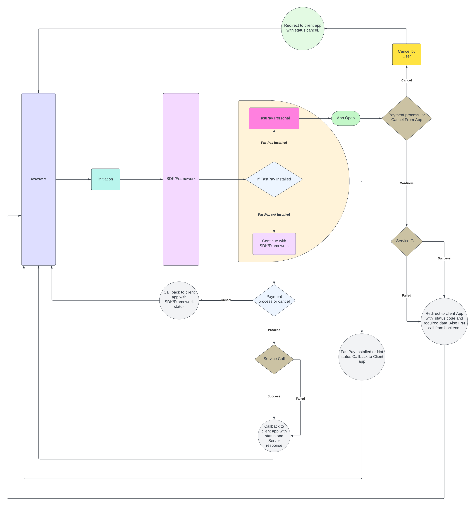

# FastPay Merchant SDK (iOS).  [](https://shields.io/) [](https://shields.io/)


[]()
[](https://fastpay.blackace.tech)
[](https://pypi.python.org/pypi/ansicolortags/)
[](https://shields.io/)

This is official documentation for fastpay merchant SDK.


## Scaffolding Provided
This repository provides the following components that are common to our open source projects:

- FastpayMerchantSDK.xcframework.zip
- FastPaySDKDocumentation.pdf

## Features
1. Make payment transaction using Fastpay App.
2. Check the status of the payments which you make.
3. Verify payment with OTP.
4. Framework status provided by callbacks.
5. Application redirect with required data while using fastpay personal applciation.

### Framework flow



## Get Started
						
Drag and drop the framework file in your project. Check ‘Copy items if needed’ and select your target.

After successfully adding the framework file in your project, select project file from Xcode’s Project Navigator and follow the selections below:

#### Target → General → Framework, Libraries and Embedded Content
and then select ​**Embed & Sign**​ for the added framework as shown below


## Implementation

Import FastpayMerchantSDK in your class
```swift
import FastpayMerchantSDK
```
		

Make your class conform to FastPayDelegate delegate
```swift
class ViewController: UIViewController, FastPayDelegate {
```

Initialize the instance of FastPay
```swift
let testObj = Fastpay(storeId: "*****", storePassword: "****", orderId: "*****", amount: 500, currency: .IQD)
```
 
Set your class as delegate for FastPayDelegate
```swift
testObj.delegate = self
```
 
Start your work with that. Use .Production for production release and use .SandBox for development test.
```swift
testObj.start(in: self, for: .Production)
```

#### Parameters to pass when initiating	
```
start(in: ….)  → your view controller class that you want the SDK to present on
storeId → Merchant’s provided store ID.
storePassword → Merchant’s provided store password.
orderId → Merchant’s provided order ID.
amount → Payable amount in the transaction.
currency → In which currency order will  perform.		
```

```swift
 Fastpay(storeId: "*****", storePassword: "****", orderId: "*****", amount: 500, currency: .IQD)
```

Implement FastPaySDK delegate method to get transaction result

For Success Case
```swift
func fastpayTransactionSucceeded(with transaction: FPTransaction) {}
```

You will get the following data from transaction object in the delegate function

```swift
 transactionId: String?
 orderId: String?
 amount: Int?
 currency: FPCurrency?
 customerMobileNo: String?
 customerName: String?
 status: String?
 transactionTime: String?
 ```
Call back Uri
### Step 
1. Create URI
Create a URI with a unique name (our suggestion is to provide your app name with prefix text “appfpclient”, for example, if your app name is “FaceLook”, your URI should be appfpclientFaceLook)
2. Add URI to your info.plist
Now add this URI to your app info.plist file

```swift
<key>CFBundleURLTypes</key>
 <array>
   <dict>
     <key>CFBundleURLSchemes</key>
     <array>
       <string>appfpclientFaceLook</string>
     </array>
   </dict>
 </array>
```
3. Add this String extension to your code base
```swift
extension String{
  func splitQueryString() -> [String: String] {
    var keyValuePairs = [String: String]()
    let components = self.components(separatedBy: “&”)
    for component in components {
      let keyValue = component.components(separatedBy: “=”)
      if keyValue.count == 2 {
        let key = keyValue[0]
        let value = keyValue[1].removingPercentEncoding ?? “”
        keyValuePairs[key] = value
      }
    }
    return keyValuePairs
  }
}
```
4. Add this Method to Your Scene Delegate. Whenever your transaction completes/fails from FastPay App, you will be navigated here with the result.
```swift
func scene(_ scene: UIScene, openURLContexts URLContexts: Set<UIOpenURLContext>) {
  guard let url = URLContexts.first?.url else {
    return
  }
}
```
Please replace `appfpclientfastpaysdktest3` with your created URI (which is added to your info.plist file too)
```swift
 if let scheme = url.scheme, scheme.lowercased() == "appfpclientfastpaysdktest3".lowercased() {
          let query            = url.query
          let data             = query?.splitQueryString()
          let transactionStatus  = data?[“transactionStatus”] // failed/success
          let transactionId      = data?[“transactionId”]
          let amount           = data?[“amount”]
          let orderId           = data?[“orderId”]
          let transactionTime    = data?[“transactionTime”]
          let currency          = data?[“currency”]
          let customerMobileNo = data?[“customerMobileNo”]
          let customerName    = data?[“customerName”]
          let status            = data?[“status”]
      print(“Transaction completed with \(transactionStatus ?? “No Status found”)“)
    }
  }
}
```

## Sample Test Code
```swift
class ViewController: UIViewController, FastPayDelegate {
    
    override func viewDidLoad() {
        super.viewDidLoad()
        
    }

    @IBAction func showAction(_ sender: UIButton){
        callSDK()
    }
    
    func callSDK(){
        let testObj = Fastpay(storeId: "1953_693", storePassword: "Password100@", orderId: "order240", amount: 500, currency: .IQD,uri: "appfpclientfastpaysdktest3")
        testObj.delegate = self
        testObj.start(in: self, for: .Sandbox)
    }
    
    func fastpayTransactionSucceeded(with transaction: FPTransaction) {

        if let transactionId = transaction.transactionId, let orderID = transaction.orderId, let billAmount = transaction.amount, let currency = transaction.currency, let customerMobileNo = transaction.customerMobileNo, let name = transaction.customerName, let status = transaction.status, let transactionTime = transaction.transactionTime{
            print("Transaction ID : \(transactionId)")
            print("Order ID : \(orderID)")
            print("Amount : \(orderID)")
            print("Bill Amount : \(billAmount)")
            print("Currency : \(currency)")
            print("Mobile Number : \(customerMobileNo)")
            print("Name : \(name)")
            print("Status : \(status)")
            print("Transaction Time : \(transactionTime)")
        }
    }
    
    func fastpayTransactionFailed(with orderId: String) {
        print("Failed Order ID: \(orderId)")
    }
    
    func fastPayProcessStatus(with status: FPFrameworkStatus) {
        print(status)
    }
}
 ```
 
### FPFrameworkStatus

In this callback, you will get Framework processing statuses, like when you redirect to the FastPay app or continue to Framework, or when Framework is cancelled by the user. Status is given below:
``` 
 public enum FPFrameworkStatus: Int{
   case INIT
   case PAYMENT_WITH_FASTPAY_APP
   case PAYMENT_WITH_FASTPAY_SDK
   case CANCEL
 }
```
 
#### N.B: For Xcode 13.0 use "FastpayMerchantSDK.framework.zip" and for XCode 13.2 or latter use "FastpayMerchantSDK.framework(xcode13.2).zip"
#### For details or clearification you can get help from document pdf. 
